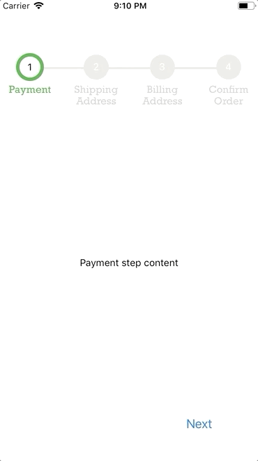
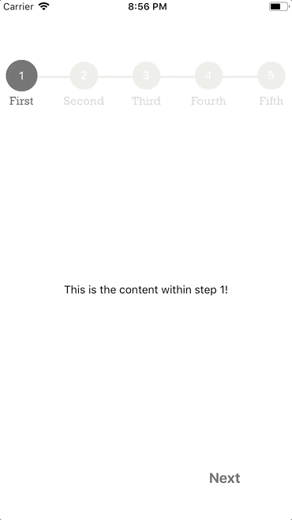

# react-native-progress-steps

A simple and fully customizable React Native component that implements a progress stepper UI. 
* Each steps content is displayed inside of a customizable ScrollView. 
* Fully customizable buttons are displayed at the bottom of the component to move between steps.


Example One             |  Example Two
:-------------------------:|:-------------------------:
 [examples/ExampleOne.js](examples/ExampleOne.js)|  [examples/ExampleTwo.js](examples/ExampleTwo.js)


## Installation

If using yarn:

```
yarn add react-native-progress-steps
```

If using npm:

```
npm i react-native-progress-steps
```

## Usage

```
import { ProgressSteps, ProgressStep } from 'react-native-progress-steps';
```

Simply place a `<ProgressStep />` tag for each desired step within the `<ProgressSteps />` wrapper.

```
<View style={{flex: 1}}>
    <ProgressSteps>
        <ProgressStep label="First Step">
            <View style={{ alignItems: 'center' }}>
                <Text>This is the content within step 1!</Text>
            </View>
        </ProgressStep>
        <ProgressStep label="Second Step">
            <View style={{ alignItems: 'center' }}>
                <Text>This is the content within step 2!</Text>
            </View>
        </ProgressStep>
        <ProgressStep label="Third Step">
            <View style={{ alignItems: 'center' }}>
                <Text>This is the content within step 3!</Text>
            </View>
        </ProgressStep>
    </ProgressSteps>
</View>
```

### Button Styling Usage
Button container and text are fully customizable using the `nextBtnStyle, nextBtnTextStyle, previousBtnStyle, and previousBtnTextStyle` props.

Example usage to change a buttons text color: 

```
const buttonTextStyle = {
    color: '#393939'
};

return (
    <View style={{flex: 1}}>
        <ProgressSteps>
            <ProgressStep label="First Step" nextBtnTextStyle={buttonTextStyle} previousBtnTextStyle={buttonTextStyle}>
                <View style={{ alignItems: 'center' }}>
                    <Text>This is the content within step 1!</Text>
                </View>
            </ProgressStep>
            <ProgressStep label="Second Step" nextBtnTextStyle={buttonTextStyle} previousBtnTextStyle={buttonTextStyle}>
                <View style={{ alignItems: 'center' }}>
                    <Text>This is the content within step 2!</Text>
                </View>
            </ProgressStep>
        </ProgressSteps>
    </View>
)
```

## Documentation

### Progress Steps Component
| Name                      | Description                              | Default     | Type   |
|---------------------------|------------------------------------------|-------------|--------|
| borderWidth               | Width of the progress bar between steps  | 6           | Number |
| borderStyle               | Type of border for the progress bar      | solid       | String |
| activeStepIconBorderColor | Outside border color for the active step | #4bb543     | String |
| progressBarColor          | Color of the default progress bar        | #ebebe4     | String |
| completedProgressBarColor | Color of the completed progress bar      | #4bb543     | String |
| activeStepIconColor       | Color of the active step icon            | transparent | String |
| completedStepIconColor    | Color of the completed step icon         | #4bb543     | String |
| disabledStepIconColor     | Color of the disabled step icon          | #ebebe4     | String |
| labelFontFamily           | Font family for the step icon label      | rockwell    | String |
| labelColor                | Color of the default label               | lightgray   | String |
| activeLabelColor          | Color of the active label                | #4bb543     | String |
| activeStepNumColor        | Color of the active step number          | black       | String |
| completedStepNumColor     | Color of the completed step number       | black       | String |
| disabledStepNumColor      | Color of the disabled step number        | white       | String |
| completedCheckColor       | Color of the completed step checkmark    | white       | String |

### Progress Step Component
| Name | Description | Default | Type |
|------------------|--------------------------------------------------------------------------|----------|---------|
| label | Title of the current step to be displayed | null | String |
| onNext | Function called when the next step button is pressed | null | Func |
| onPrevious | Function called when the previous step button is pressed | null | Func |
| onSubmit | Function called when the submit step button is pressed | null | Func |
| nextBtnText | Text to display inside the next button | Next | String |
| previousBtnText | Text to display inside the previous button | Previous | String |
| finishBtnText | Text to display inside the button on the last step | Submit | String |
| nextBtnStyle | Style object to provide to the next/finish buttons | { textAlign: 'center', padding: 8 } | Object |
| nextBtnTextStyle | Style object to provide to the next/finish button text | { color: '#007aff', fontSize: 18 } | Object |
| previousBtnStyle | Style object to provide to the previous button | { textAlign: 'center', padding: 8 } | Object |
| previousBtnTextStyle | Style object to provide to the previous button text | { color: '#007aff', fontSize: 18 } | Object |
| centerContainer | Value that decides whether to center content inside ScrollView container | false | Boolean |

## Contributing
Pull requests are always welcome! Feel free to open a new GitHub issue for any changes that can be made.

## Author
Colby Miller | [https://colbymillerdev.com](https://colbymillerdev.com)

## License
[MIT](./LICENSE)
